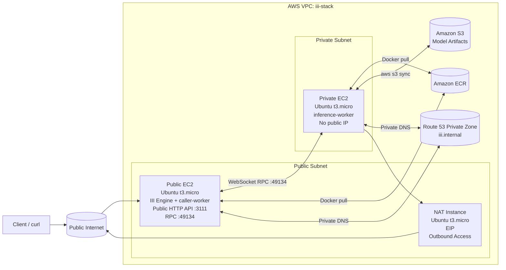

# III Distributed Inferencing Prototype on AWS

This repository contains a production-style AWS implementation for the III distributed inferencing prototype. It uses two EC2 workers, private VPC networking, ECR for images, S3 for model artifacts, Route 53 private DNS for internal RPC, Terraform for reproducible infrastructure, and systemd to manage Docker containers on Ubuntu.

## Architecture



The rendered diagram is also available at [docs/architecture.mmd](docs/architecture.mmd).

## What Runs Where

- Public EC2 instance:
  - III Engine container
  - caller-worker container
  - Public HTTP API on port `3111`
  - WebSocket RPC listener on port `49134`
- Private EC2 instance:
  - inference-worker container
  - No public IP
  - Pulls model artifacts from S3 during bootstrap
- NAT instance:
  - Provides outbound internet access for the private subnet so it can reach ECR and S3

## Repository Structure

```text
.
├── caller-worker/
│   ├── Dockerfile
│   ├── package.json
│   ├── tsconfig.json
│   ├── iii-sdk/
│   │   ├── index.js
│   │   └── package.json
│   └── src/worker.ts
├── engine/
│   ├── Dockerfile
│   ├── index.js
│   └── package.json
├── inference-worker/
│   ├── Dockerfile
│   ├── iii_sdk.py
│   ├── inference_worker.py
│   └── requirements.txt
├── terraform/
│   ├── main.tf
│   ├── outputs.tf
│   ├── templates/
│   │   ├── user-data-nat.sh.tftpl
│   │   ├── user-data-private.sh.tftpl
│   │   └── user-data-public.sh.tftpl
│   ├── variables.tf
│   └── versions.tf
├── deploy/
│   ├── config/config.yaml
│   └── systemd/
│       ├── caller-worker.service
│       ├── iii-engine.service
│       └── inference-worker.service
├── scripts/
│   ├── deploy.sh
│   └── ssh.sh
├── .github/workflows/
│   └── ci.yml
└── docs/
    └── architecture.mmd
```

## Terraform Setup

The Terraform stack creates:

- `aws_vpc`, `aws_subnet`, `aws_route_table`, `aws_internet_gateway`
- `aws_security_group` rules for public HTTP, internal RPC, and restricted SSH
- `aws_instance` resources for the NAT instance, public API EC2, and private inference EC2
- `aws_eip` for the public instance and NAT instance
- `aws_ecr_repository` for the three container images
- `aws_s3_bucket` for model artifacts
- `aws_route53_zone` private DNS for internal service discovery
- IAM roles and instance profiles with least-privilege access

### Example variables

```bash
export TF_VAR_aws_region="us-east-1"
export TF_VAR_project_name="iii-stack"
export TF_VAR_admin_cidr="YOUR_IP/32"
export TF_VAR_ec2_key_name="your-keypair"
```

### Apply infrastructure

```bash
cd terraform
terraform init
terraform apply
```

### Outputs

- `public_eip`
- `public_instance_id`
- `private_instance_id`
- `nat_instance_id`
- `ecr_repository_urls`
- `model_bucket_name`
- `engine_private_dns`

## Docker and ECR Flow

The deployment uses Docker images pushed to Amazon ECR:

- `iii-engine`
- `caller-worker`
- `inference-worker`

The CI workflow validates the Dockerfiles and can push tagged images to ECR on `main` when `AWS_ROLE_TO_ASSUME` is configured.

## Deployment Automation

The deploy script:

1. Applies Terraform.
2. Builds the three Docker images.
3. Pushes them to ECR.
4. Uses AWS Systems Manager to start the services on both EC2 instances.

```bash
export AWS_REGION=us-east-1
export PROJECT_NAME=iii-stack
export IMAGE_TAG=latest
./scripts/deploy.sh
```

## SSH and Instance Access

The preferred access method is AWS Systems Manager Session Manager.

```bash
./scripts/ssh.sh i-0123456789abcdef0
```

If you prefer classic SSH, use the EC2 key pair configured in Terraform and connect to the public instance only.

## Internal RPC Networking

- `III_URL` on both workers resolves to `ws://iii-engine.iii.internal:49134`
- Route 53 private hosted zone `iii.internal` resolves the engine host inside the VPC
- The public HTTP API is the only internet-facing service
- The inference worker stays private and does not receive a public IP

## Linux Paths on EC2

- App root: `/opt/iii-stack`
- Config: `/opt/iii-stack/deploy/config/config.yaml`
- Model files: `/opt/models/gemma-3-270m`
- Runtime env: `/etc/iii-stack/runtime.env`
- Systemd units: `/etc/systemd/system/`

## HTTP API Example

```bash
curl -X POST "http://PUBLIC_EIP:3111/v1/chat/completions" \
  -H "Content-Type: application/json" \
  -d '{
    "messages": [
      {
        "role": "user",
        "content": "Explain the benefit of splitting public API and private inference into separate EC2 instances."
      }
    ],
    "max_new_tokens": 128,
    "temperature": 0.7
  }'
```

## Security Group Rules

- Public EC2:
  - TCP `3111` from `0.0.0.0/0`
  - TCP `49134` from the VPC CIDR only
  - TCP `22` from the admin CIDR only
- Private EC2:
  - TCP `49134` from the VPC CIDR only
  - Optional SSH from the public subnet CIDR
- NAT instance:
  - SSH from the admin CIDR only
  - Forwarding from the private subnet only

## Production Hardening

- Use Systems Manager instead of opening SSH broadly.
- Restrict `admin_cidr` to your workstation IP.
- Keep model data in S3 and download it during bootstrap.
- Use private DNS rather than hardcoded IPs for internal RPC.
- Enable CloudWatch logs and alarms for service restarts, HTTP 5xxs, and memory pressure.
- Rotate ECR images via CI using Git SHA tags.
- Consider an ALB and ACM certificate if you want TLS termination in front of the public EC2 instance.
- Consider an Auto Scaling Group if you later need more than one public or private worker.

## Scaling Strategy for a 100x Larger Model

- Move the inference worker to a larger compute family or GPU-backed EC2.
- Store the model in S3 and prewarm it on boot, or bake it into an AMI for faster startups.
- Split ingress from inference further by adding queueing and backpressure.
- Use quantization or a serving runtime specialized for very large models.
- Add horizontal scaling with an Auto Scaling Group or ECS/EKS if request volume grows.

## Monitoring and Logging

- Send systemd and container logs to CloudWatch Logs.
- Track:
  - public HTTP 5xx rate
  - worker restarts
  - SSM command failures
  - ECR pull failures
  - NAT instance health
  - CPU and memory pressure
- Add a CloudWatch agent or Fluent Bit later if you want structured log shipping.
- Use CloudWatch for alarms and log retention, Prometheus for metrics scraping, and Grafana for dashboards.
- A small dedicated monitoring EC2 instance can run Prometheus and Grafana in Docker if you want everything self-hosted for the internship demo.

## CI/CD Suggestions

- Validate Terraform with `terraform fmt -check` and `terraform validate`.
- Build Docker images on every PR.
- Push tagged images to ECR on `main` with GitHub Actions and an AWS OIDC role.
- Run deployment as a separate step so infrastructure and app images can be promoted independently.

## Project Overview

This is a distributed inference platform deployed on AWS EC2 infrastructure. The architecture separates the public-facing API from private inference workloads across different EC2 instances. The public instance runs the III Engine and caller worker with HTTP API access, while the private instance runs the inference worker and pulls model artifacts from S3. Infrastructure is managed with Terraform, deployments use Docker and ECR, and access is controlled through AWS Systems Manager.

## Commands to Remember

```bash
terraform -chdir=terraform init
terraform -chdir=terraform apply
./scripts/deploy.sh
./scripts/ssh.sh i-xxxxxxxxxxxxxxxxx
```
# CI/CD fix - force workflow run
# Workflow trigger
